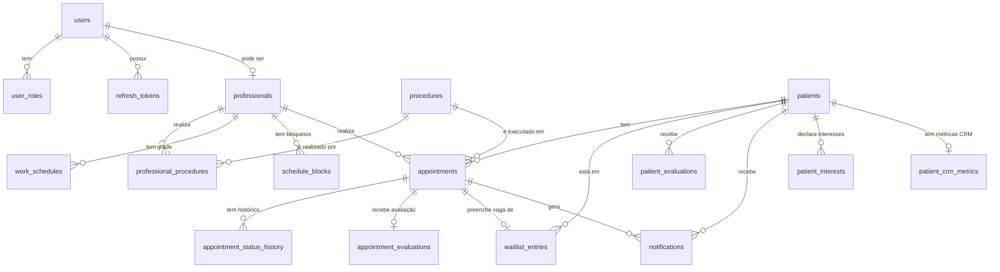

# MyAgendix — Modelagem do Banco de Dados

> Última atualização: Abril de 2026
> SGBD: PostgreSQL 16
> ORM: Prisma

---

## 1. Estratégia Multi-Tenant

**Abordagem: Schema-per-Tenant**

Cada clínica (tenant) possui seu próprio schema isolado no PostgreSQL. O schema `public` contém exclusivamente as tabelas da plataforma (tenants, planos, billing). Nenhum dado de uma clínica cruza com o de outra em nível de banco.

```
PostgreSQL
│
├── schema: public
│   ├── tenants
│   ├── super_admin_users
│   ├── plans              (MVP2)
│   └── subscriptions      (MVP2)
│
├── schema: clinica_abc
│   ├── users
│   ├── professionals
│   ├── patients
│   ├── appointments
│   └── ... (todas as tabelas do tenant)
│
└── schema: clinica_xyz
    └── ... (schema idêntico, dados isolados)
```

O schema correto é resolvido no início de cada request via JWT ou slug da URL, e o Prisma client é instanciado apontando para o schema do tenant.

---

## 2. Convenções

| Convenção         | Decisão                                                  |
|-------------------|----------------------------------------------------------|
| IDs               | `UUID` gerado via `gen_random_uuid()`                    |
| Timestamps        | `TIMESTAMPTZ` — sempre com timezone                      |
| Soft delete       | Campo `is_active BOOLEAN` nas entidades principais       |
| Nomenclatura      | `snake_case` em todos os campos e tabelas                |
| Valores monetários | Armazenados em **centavos** (INTEGER) para evitar float |
| Enums             | Definidos no Prisma schema como `enum`                   |

---

## 3. Enums Globais

```
Role             → GESTOR | PROFISSIONAL | RECEPCAO

AppointmentStatus → SCHEDULED | PATIENT_PRESENT | IN_PROGRESS
                    | COMPLETED | CANCELED

WaitlistStatus   → WAITING | NOTIFIED | CONFIRMED | EXPIRED | REMOVED

NotificationType → APPOINTMENT_CONFIRMATION | APPOINTMENT_REMINDER
                   | WAITLIST_VACANCY | CAMPAIGN | RETENTION_SUGGESTION | CUSTOM

NotificationChannel → WHATSAPP | SMS | EMAIL
NotificationStatus  → PENDING | SENT | FAILED | READ

PatientSource    → MANUAL | PUBLIC_PAGE | INVITE

Gender           → MALE | FEMALE | OTHER | PREFER_NOT_TO_SAY

PatientClassification → BRONZE | SILVER | GOLD   (MVP2 — CRM)

PatientInterestType   → PROCEDURE | AREA          (MVP2 — CRM)

PlanType         → BASIC | PRO          (MVP1 simplificado)

-- MVP2
SubscriptionStatus → TRIALING | ACTIVE | PAST_DUE | CANCELED
BillingCycle       → MONTHLY | YEARLY
CommunicationTone  → FORMAL | CASUAL | FRIENDLY
ConversationStatus → OPEN | CLOSED
MessageSenderType  → PATIENT | USER | AI
CampaignStatus     → DRAFT | SCHEDULED | SENDING | SENT | CANCELED
CampaignChannel    → WHATSAPP | SMS | EMAIL
CanceledBy         → PATIENT | STAFF
```

---

## 4. Schema Public

### 4.1 `tenants`

Registro de cada clínica/negócio na plataforma.

| Campo         | Tipo              | Restrições              | Descrição                              |
|---------------|-------------------|-------------------------|----------------------------------------|
| id            | UUID              | PK, default uuid        |                                        |
| name          | VARCHAR(255)      | NOT NULL                | Nome da clínica                        |
| slug          | VARCHAR(100)      | UNIQUE, NOT NULL        | Identificador na URL pública           |
| email         | VARCHAR(255)      | NOT NULL                | Email de contato da clínica            |
| phone         | VARCHAR(20)       |                         | Telefone de contato                    |
| logo_url      | TEXT              |                         | URL da logo no MinIO                   |
| address       | TEXT              |                         | Endereço da clínica                    |
| plan_type     | PlanType          | DEFAULT 'BASIC'         | Plano ativo (simplificado no MVP1)     |
| is_active     | BOOLEAN           | DEFAULT true            | Ativo/inativo na plataforma            |
| created_at    | TIMESTAMPTZ       | DEFAULT now()           |                                        |
| updated_at    | TIMESTAMPTZ       | DEFAULT now()           |                                        |

**Índices:** `slug` (unique), `is_active`

---

### 4.2 `super_admin_users`

Usuários com acesso ao painel da plataforma (cadastram e gerenciam tenants).

| Campo         | Tipo         | Restrições       | Descrição                   |
|---------------|--------------|------------------|-----------------------------|
| id            | UUID         | PK               |                             |
| name          | VARCHAR(255) | NOT NULL         |                             |
| email         | VARCHAR(255) | UNIQUE, NOT NULL |                             |
| password_hash | VARCHAR(255) | NOT NULL         |                             |
| is_active     | BOOLEAN      | DEFAULT true     |                             |
| created_at    | TIMESTAMPTZ  |                  |                             |
| updated_at    | TIMESTAMPTZ  |                  |                             |

**Índices:** `email` (unique)

---

### 4.3 `super_admin_refresh_tokens`

Refresh tokens do Super Admin. Mesma estratégia de segurança dos tokens de tenant: SHA-256, rotation, detecção de roubo.

| Campo      | Tipo         | Restrições        | Descrição                              |
|------------|--------------|-------------------|----------------------------------------|
| id         | UUID         | PK                |                                        |
| user_id    | UUID         | FK → super_admin_users | NOT NULL                          |
| token_hash | VARCHAR(255) | UNIQUE, NOT NULL  | SHA-256 do refresh token               |
| expires_at | TIMESTAMPTZ  | NOT NULL          | Calculado com `Date.now() + refreshExpiresInMs` |
| revoked_at | TIMESTAMPTZ  |                   | Preenchido ao revogar                  |
| created_at | TIMESTAMPTZ  | DEFAULT now()     |                                        |

**Índices:** `token_hash` (unique), `user_id`

---

### 4.4 `plans` *(MVP2)*

Planos disponíveis para contratação na plataforma.

| Campo                      | Tipo         | Descrição                                         |
|----------------------------|--------------|---------------------------------------------------|
| id                         | UUID         | PK                                                |
| name                       | VARCHAR(100) | Ex: "Básico", "Pro"                               |
| slug                       | VARCHAR(50)  | UNIQUE — identificador do plano                   |
| description                | TEXT         |                                                   |
| price_monthly_cents        | INTEGER      | Preço mensal em centavos                          |
| price_yearly_cents         | INTEGER      | Preço anual em centavos (pode ser nulo)           |
| max_professionals          | INTEGER      | Limite de profissionais                           |
| max_monthly_appointments   | INTEGER      | Limite de agendamentos/mês                        |
| features                   | JSONB        | Funcionalidades incluídas no plano                |
| is_active                  | BOOLEAN      | DEFAULT true                                      |
| created_at                 | TIMESTAMPTZ  |                                                   |
| updated_at                 | TIMESTAMPTZ  |                                                   |

---

### 4.4 `subscriptions` *(MVP2)*

Assinatura de um tenant a um plano.

| Campo                    | Tipo               | Descrição                                     |
|--------------------------|--------------------|-----------------------------------------------|
| id                       | UUID               | PK                                            |
| tenant_id                | UUID               | FK → tenants.id                               |
| plan_id                  | UUID               | FK → plans.id                                 |
| status                   | SubscriptionStatus |                                               |
| billing_cycle            | BillingCycle       |                                               |
| current_period_start     | TIMESTAMPTZ        |                                               |
| current_period_end       | TIMESTAMPTZ        |                                               |
| external_subscription_id | VARCHAR(255)       | ID da assinatura no gateway (Stripe, Asaas)   |
| external_customer_id     | VARCHAR(255)       | ID do cliente no gateway                      |
| canceled_at              | TIMESTAMPTZ        |                                               |
| created_at               | TIMESTAMPTZ        |                                               |
| updated_at               | TIMESTAMPTZ        |                                               |

**Índices:** `tenant_id`, `external_subscription_id`

---

## 5. Schema Tenant

> Todas as tabelas abaixo existem em cada schema de tenant (ex: `clinica_abc.*`).

---

### 5.1 Domínio: Autenticação

#### `users`

Usuários com acesso ao painel da clínica (Gestor, Profissional, Recepção).

| Campo         | Tipo         | Restrições            | Descrição                            |
|---------------|--------------|-----------------------|--------------------------------------|
| id            | UUID         | PK                    |                                      |
| name          | VARCHAR(255) | NOT NULL              |                                      |
| email         | VARCHAR(255) | UNIQUE, NOT NULL      | Único dentro do tenant               |
| password_hash | VARCHAR(255) | NOT NULL              |                                      |
| phone         | VARCHAR(20)  |                       |                                      |
| avatar_url    | TEXT         |                       | URL no MinIO                         |
| is_active     | BOOLEAN      | DEFAULT true          |                                      |
| created_at    | TIMESTAMPTZ  |                       |                                      |
| updated_at    | TIMESTAMPTZ  |                       |                                      |

**Índices:** `email` (unique), `is_active`

---

#### `user_roles`

Um usuário pode ter múltiplos papéis (ex: Gestor que também é Profissional).

| Campo   | Tipo   | Restrições               | Descrição         |
|---------|--------|--------------------------|-------------------|
| user_id | UUID   | FK → users.id            |                   |
| role    | Role   | NOT NULL                 |                   |

**PK composta:** `(user_id, role)`

---

#### `refresh_tokens`

Controle de sessões e revogação de tokens.

| Campo      | Tipo         | Descrição                                    |
|------------|--------------|----------------------------------------------|
| id         | UUID         | PK                                           |
| user_id    | UUID         | FK → users.id                                |
| token_hash | VARCHAR(255) | Token armazenado com hash                    |
| expires_at | TIMESTAMPTZ  | Expiração do token                           |
| revoked_at | TIMESTAMPTZ  | Preenchido ao revogar (logout, troca de senha) |
| created_at | TIMESTAMPTZ  |                                              |

**Índices:** `token_hash` (unique), `user_id`

---

### 5.2 Domínio: Clínica

#### `professionals`

Profissionais que realizam atendimentos. Podem ou não ter acesso ao sistema.

| Campo       | Tipo         | Restrições           | Descrição                                      |
|-------------|--------------|----------------------|------------------------------------------------|
| id          | UUID         | PK                   |                                                |
| user_id     | UUID         | FK → users.id, NULL  | Vínculo com login — nulo se não tiver acesso   |
| name        | VARCHAR(255) | NOT NULL             |                                                |
| specialty   | VARCHAR(255) |                      | Ex: Dermatologista, Fisioterapeuta             |
| bio         | TEXT         |                      | Apresentação pública                           |
| avatar_url  | TEXT         |                      | URL no MinIO                                   |
| color       | VARCHAR(7)   |                      | Cor hex para exibição no calendário            |
| is_active   | BOOLEAN      | DEFAULT true         |                                                |
| created_at  | TIMESTAMPTZ  |                      |                                                |
| updated_at  | TIMESTAMPTZ  |                      |                                                |

**Índices:** `user_id`, `is_active`

---

#### `procedures`

Serviços/procedimentos oferecidos pela clínica.

| Campo            | Tipo         | Restrições   | Descrição                         |
|------------------|--------------|--------------|-----------------------------------|
| id               | UUID         | PK           |                                   |
| name             | VARCHAR(255) | NOT NULL     |                                   |
| description      | TEXT         |              |                                   |
| duration_minutes | INTEGER      | NOT NULL     | Duração padrão do procedimento    |
| color            | VARCHAR(7)   |              | Cor hex para exibição no calendário |
| is_active        | BOOLEAN      | DEFAULT true |                                   |
| created_at       | TIMESTAMPTZ  |              |                                   |
| updated_at       | TIMESTAMPTZ  |              |                                   |

---

#### `professional_procedures`

Quais procedimentos cada profissional está habilitado a realizar.

| Campo           | Tipo | Restrições                    |
|-----------------|------|-------------------------------|
| professional_id | UUID | FK → professionals.id         |
| procedure_id    | UUID | FK → procedures.id            |

**PK composta:** `(professional_id, procedure_id)`

---

#### `work_schedules`

Grade semanal de atendimento de cada profissional.

| Campo                 | Tipo      | Restrições                        | Descrição                           |
|-----------------------|-----------|-----------------------------------|-------------------------------------|
| id                    | UUID      | PK                                |                                     |
| professional_id       | UUID      | FK → professionals.id             |                                     |
| day_of_week           | SMALLINT  | NOT NULL, 0–6 (0=Dom, 1=Seg...)   | Dia da semana                       |
| start_time            | TIME      | NOT NULL                          | Início do expediente                |
| end_time              | TIME      | NOT NULL                          | Fim do expediente                   |
| slot_interval_minutes | INTEGER   | NOT NULL, DEFAULT 30              | Intervalo entre slots de agendamento |
| is_active             | BOOLEAN   | DEFAULT true                      |                                     |
| created_at            | TIMESTAMPTZ |                                 |                                     |
| updated_at            | TIMESTAMPTZ |                                 |                                     |

**Índices:** `professional_id`
**Constraint unique:** `(professional_id, day_of_week)` — uma linha por dia por profissional

---

#### `schedule_blocks`

Bloqueios de agenda: folgas, férias, indisponibilidades pontuais.

| Campo               | Tipo        | Descrição                          |
|---------------------|-------------|------------------------------------|
| id                  | UUID        | PK                                 |
| professional_id     | UUID        | FK → professionals.id              |
| start_datetime      | TIMESTAMPTZ | NOT NULL                           |
| end_datetime        | TIMESTAMPTZ | NOT NULL                           |
| reason              | TEXT        | Motivo do bloqueio (interno)       |
| created_by_user_id  | UUID        | FK → users.id                      |
| created_at          | TIMESTAMPTZ |                                    |

**Índices:** `professional_id`, `(start_datetime, end_datetime)`

---

### 5.3 Domínio: Pacientes

#### `patients`

Pacientes da clínica. Identificados pelo telefone dentro do tenant.

| Campo                         | Tipo               | Restrições       | Descrição                                      |
|-------------------------------|--------------------|------------------|------------------------------------------------|
| id                            | UUID               | PK               |                                                |
| name                          | VARCHAR(255)       | NOT NULL         |                                                |
| phone                         | VARCHAR(20)        | UNIQUE, NOT NULL | Identificador principal — único no tenant      |
| email                         | VARCHAR(255)       |                  | Opcional                                       |
| birth_date                    | DATE               |                  | Usado para campanhas de aniversário            |
| gender                        | Gender             |                  | Segmentação e personalização                   |
| city                          | VARCHAR(255)       |                  | Segmentação geográfica                         |
| preferred_contact_channel     | NotificationChannel |                 | Canal preferido: WHATSAPP, EMAIL ou SMS        |
| preferred_contact_time_start  | TIME               |                  | Horário preferido para contato                 |
| preferred_days_of_week        | SMALLINT[]         |                  | Dias preferidos (0=Dom...6=Sáb)                |
| marketing_opt_in              | BOOLEAN            | DEFAULT false    | Opt-in para campanhas/promoções (LGPD)         |
| notes                         | TEXT               |                  | Observações internas visíveis à equipe         |
| source                        | PatientSource      | DEFAULT 'MANUAL' | Como o paciente entrou no sistema              |
| is_active                     | BOOLEAN            | DEFAULT true     |                                                |
| created_at                    | TIMESTAMPTZ        |                  |                                                |
| updated_at                    | TIMESTAMPTZ        |                  |                                                |

**Índices:** `phone` (unique), `name` (trigram — busca por nome), `is_active`, `birth_date` (para query de aniversariantes)

---

#### `patient_interests` *(MVP2 — CRM)*

Procedimentos e áreas de interesse declarados pelo paciente. Alimenta campanhas segmentadas antes mesmo de um histórico de atendimentos.

| Campo      | Tipo               | Restrições       | Descrição                                         |
|------------|--------------------|------------------|---------------------------------------------------|
| id         | UUID               | PK               |                                                   |
| patient_id | UUID               | FK → patients.id |                                                   |
| type       | PatientInterestType | NOT NULL        | PROCEDURE (ex: Botox) ou AREA (ex: Facial)        |
| value      | VARCHAR(255)       | NOT NULL         | Valor do interesse (texto livre)                  |
| created_at | TIMESTAMPTZ        |                  |                                                   |

**Índices:** `patient_id`, `(type, value)` — facilita segmentação por interesse

---

#### `patient_evaluations`

Observações internas dos profissionais sobre pacientes. Visível apenas pela equipe da clínica.

| Campo               | Tipo         | Descrição                                 |
|---------------------|--------------|-------------------------------------------|
| id                  | UUID         | PK                                        |
| patient_id          | UUID         | FK → patients.id                          |
| created_by_user_id  | UUID         | FK → users.id                             |
| notes               | TEXT         | NOT NULL                                  |
| tags                | TEXT[]       | Ex: ['PUNCTUAL', 'FREQUENT_CANCELLATIONS'] |
| created_at          | TIMESTAMPTZ  |                                           |
| updated_at          | TIMESTAMPTZ  |                                           |

**Índices:** `patient_id`

---

### 5.4 Domínio: Agendamentos

#### `appointments`

Consultas agendadas — coração operacional do sistema.

| Campo               | Tipo               | Restrições                   | Descrição                                         |
|---------------------|--------------------|------------------------------|---------------------------------------------------|
| id                  | UUID               | PK                           |                                                   |
| patient_id          | UUID               | FK → patients.id             |                                                   |
| professional_id     | UUID               | FK → professionals.id        |                                                   |
| procedure_id        | UUID               | FK → procedures.id           |                                                   |
| scheduled_date      | DATE               | NOT NULL                     |                                                   |
| start_time          | TIME               | NOT NULL                     |                                                   |
| end_time            | TIME               | NOT NULL                     | Calculado: start_time + procedure.duration        |
| status              | AppointmentStatus  | DEFAULT 'SCHEDULED'          |                                                   |
| cancellation_reason | TEXT               |                              | Preenchido ao cancelar                            |
| canceled_by         | CanceledBy         |                              | PATIENT ou STAFF                                  |
| notes               | TEXT               |                              | Observações da recepção                           |
| created_by_user_id  | UUID               | FK → users.id, NULL          | Nulo = agendamento pela página pública            |
| created_at          | TIMESTAMPTZ        |                              |                                                   |
| updated_at          | TIMESTAMPTZ        |                              |                                                   |

**Índices:** `(professional_id, scheduled_date)`, `patient_id`, `status`, `scheduled_date`

**Constraint:** Sem sobreposição de horário para o mesmo profissional no mesmo dia (verificada na aplicação e reforçada por trigger ou constraint de exclusão).

---

#### `appointment_status_history`

Auditoria completa de todas as mudanças de status de um agendamento.

| Campo               | Tipo               | Descrição                                  |
|---------------------|--------------------|--------------------------------------------|
| id                  | UUID               | PK                                         |
| appointment_id      | UUID               | FK → appointments.id                       |
| status              | AppointmentStatus  |                                            |
| changed_by_user_id  | UUID               | FK → users.id — nulo se mudança pelo paciente |
| notes               | TEXT               |                                            |
| changed_at          | TIMESTAMPTZ        | DEFAULT now()                              |

**Índices:** `appointment_id`

---

### 5.5 Domínio: Lista de Espera

#### `waitlist_entries`

Pacientes aguardando vagas em procedimentos ou com profissionais específicos.

| Campo                 | Tipo           | Restrições            | Descrição                                        |
|-----------------------|----------------|-----------------------|--------------------------------------------------|
| id                    | UUID           | PK                    |                                                  |
| patient_id            | UUID           | FK → patients.id      |                                                  |
| professional_id       | UUID           | FK → professionals.id, NULL | Nulo = qualquer profissional disponível    |
| procedure_id          | UUID           | FK → procedures.id    |                                                  |
| preferred_date_from   | DATE           |                       | Início do período desejado                       |
| preferred_date_to     | DATE           |                       | Fim do período desejado                          |
| min_advance_minutes   | INTEGER        | NOT NULL, DEFAULT 60  | Antecedência mínima que o paciente precisa       |
| status                | WaitlistStatus | DEFAULT 'WAITING'     |                                                  |
| notified_at           | TIMESTAMPTZ    |                       | Quando a notificação de vaga foi enviada         |
| confirmed_at          | TIMESTAMPTZ    |                       | Quando o paciente confirmou                      |
| expires_at            | TIMESTAMPTZ    |                       | Prazo para o paciente confirmar a vaga           |
| appointment_id        | UUID           | FK → appointments.id, NULL | Preenchido quando a vaga é confirmada       |
| created_at            | TIMESTAMPTZ    |                       |                                                  |
| updated_at            | TIMESTAMPTZ    |                       |                                                  |

**Índices:** `status`, `patient_id`, `(professional_id, procedure_id)`

---

### 5.6 Domínio: Notificações

#### `notifications`

Registro de todas as notificações enviadas (confirmações, lembretes, vagas).

| Campo          | Tipo                  | Descrição                                    |
|----------------|-----------------------|----------------------------------------------|
| id             | UUID                  | PK                                           |
| patient_id     | UUID                  | FK → patients.id, nullable                   |
| user_id        | UUID                  | FK → users.id, nullable (notif. para staff)  |
| type           | NotificationType      |                                              |
| channel        | NotificationChannel   |                                              |
| recipient      | VARCHAR(255)          | NOT NULL — telefone ou email do destinatário |
| content        | TEXT                  | NOT NULL — conteúdo enviado                  |
| status         | NotificationStatus    | DEFAULT 'PENDING'                            |
| appointment_id | UUID                  | FK → appointments.id, nullable               |
| external_id    | VARCHAR(255)          | ID da mensagem no gateway (Z-API, Twilio)    |
| sent_at        | TIMESTAMPTZ           |                                              |
| failed_reason  | TEXT                  | Motivo da falha, se houver                   |
| created_at     | TIMESTAMPTZ           |                                              |

**Índices:** `patient_id`, `status`, `appointment_id`, `type`

---

### 5.7 Domínio: Avaliações

#### `appointment_evaluations`

Avaliação do paciente sobre o atendimento. Máximo uma por consulta.

| Campo           | Tipo      | Restrições                          | Descrição                      |
|-----------------|-----------|-------------------------------------|--------------------------------|
| id              | UUID      | PK                                  |                                |
| appointment_id  | UUID      | FK → appointments.id, UNIQUE        | Uma avaliação por consulta     |
| patient_id      | UUID      | FK → patients.id                    |                                |
| professional_id | UUID      | FK → professionals.id               |                                |
| rating          | SMALLINT  | NOT NULL, CHECK (1–5)               | Nota de 1 a 5 estrelas         |
| comment         | TEXT      |                                     | Comentário opcional            |
| created_at      | TIMESTAMPTZ |                                   |                                |

**Índices:** `appointment_id` (unique), `professional_id`, `rating`

---

### 5.8 Domínio: MVP2

> Tabelas a serem criadas no desenvolvimento do MVP2. O schema é definido agora para evitar refatorações futuras no modelo.

#### `patient_crm_metrics` *(MVP2 — CRM)*

Cache de métricas de CRM por paciente. Atualizado por um worker assíncrono após cada agendamento. Evita queries pesadas em tempo real nas listagens do CRM.

| Campo                    | Tipo                 | Restrições                 | Descrição                                        |
|--------------------------|----------------------|----------------------------|--------------------------------------------------|
| id                       | UUID                 | PK                         |                                                  |
| patient_id               | UUID                 | FK → patients.id, UNIQUE   | 1:1 com patients                                 |
| total_appointments       | INTEGER              | DEFAULT 0                  | Total de consultas realizadas                    |
| last_appointment_at      | TIMESTAMPTZ          |                            | Data da última consulta                          |
| cancellation_count       | INTEGER              | DEFAULT 0                  | Total de cancelamentos pelo paciente             |
| classification           | PatientClassification | DEFAULT 'BRONZE'           | BRONZE / SILVER / GOLD (baseado no volume)       |
| preferred_appointment_hour | SMALLINT           |                            | Hora mais frequente nos agendamentos (0–23)      |
| updated_at               | TIMESTAMPTZ          | DEFAULT now()              | Última atualização pelo worker                   |

**Índices:** `patient_id` (unique), `classification` — segmento CRM de alto valor

> **Nota:** A classificação no MVP2 é baseada em volume de consultas como proxy de valor (`total_appointments`). Em Fase 3, quando `procedures` tiver `price_cents`, a classificação passará a usar `valor total gasto`.

---

#### `ai_config`

Configuração do assistente de IA da clínica (uma linha por tenant).

| Campo              | Tipo              | Descrição                              |
|--------------------|-------------------|----------------------------------------|
| id                 | UUID              | PK                                     |
| assistant_name     | VARCHAR(100)      | DEFAULT 'Assistente'                   |
| communication_tone | CommunicationTone | DEFAULT 'FRIENDLY'                     |
| welcome_message    | TEXT              |                                        |
| faq                | JSONB             | Array de `{question, answer}`          |
| is_active          | BOOLEAN           | DEFAULT false                          |
| created_at         | TIMESTAMPTZ       |                                        |
| updated_at         | TIMESTAMPTZ       |                                        |

---

#### `conversations`

Threads de chat entre paciente e equipe da clínica.

| Campo            | Tipo               | Descrição                                |
|------------------|--------------------|------------------------------------------|
| id               | UUID               | PK                                       |
| patient_id       | UUID               | FK → patients.id                         |
| assigned_user_id | UUID               | FK → users.id, nullable — atendente atual |
| status           | ConversationStatus | DEFAULT 'OPEN'                           |
| created_at       | TIMESTAMPTZ        |                                          |
| updated_at       | TIMESTAMPTZ        |                                          |

**Índices:** `patient_id`, `status`

---

#### `messages`

Mensagens individuais dentro de uma conversa.

| Campo           | Tipo              | Descrição                                       |
|-----------------|-------------------|-------------------------------------------------|
| id              | UUID              | PK                                              |
| conversation_id | UUID              | FK → conversations.id                           |
| sender_type     | MessageSenderType | PATIENT, USER ou AI                             |
| sender_id       | UUID              | nullable — user_id se sender_type = USER        |
| content         | TEXT              | NOT NULL                                        |
| read_at         | TIMESTAMPTZ       |                                                 |
| sent_at         | TIMESTAMPTZ       | DEFAULT now()                                   |

**Índices:** `conversation_id`, `sent_at`

---

#### `campaigns`

Campanhas promocionais criadas pelo gestor.

| Campo               | Tipo            | Descrição                           |
|---------------------|-----------------|-------------------------------------|
| id                  | UUID            | PK                                  |
| title               | VARCHAR(255)    | NOT NULL                            |
| content             | TEXT            | NOT NULL — mensagem da campanha     |
| channel             | CampaignChannel |                                     |
| target_segment      | JSONB           | Critérios de segmentação            |
| status              | CampaignStatus  | DEFAULT 'DRAFT'                     |
| scheduled_at        | TIMESTAMPTZ     | Para campanhas agendadas            |
| sent_at             | TIMESTAMPTZ     |                                     |
| created_by_user_id  | UUID            | FK → users.id                       |
| created_at          | TIMESTAMPTZ     |                                     |
| updated_at          | TIMESTAMPTZ     |                                     |

---

#### `campaign_recipients`

Pacientes selecionados para uma campanha.

| Campo      | Tipo        | Descrição                      |
|------------|-------------|--------------------------------|
| id         | UUID        | PK                             |
| campaign_id | UUID       | FK → campaigns.id              |
| patient_id | UUID        | FK → patients.id               |
| status     | ENUM        | PENDING, SENT, FAILED          |
| sent_at    | TIMESTAMPTZ |                                |

**Índices:** `campaign_id`
**Constraint unique:** `(campaign_id, patient_id)`

---

#### `payment_methods` *(MVP2)*

Métodos de pagamento armazenados pelo tenant para assinatura recorrente. Tokens sensíveis ficam no gateway — aqui apenas a referência.

| Campo               | Tipo         | Descrição                                          |
|---------------------|--------------|----------------------------------------------------|
| id                  | UUID         | PK                                                 |
| tenant_id           | VARCHAR(100) | Identificador do tenant (para referência cross-schema) |
| type                | ENUM         | CREDIT_CARD, PIX, BOLETO                           |
| external_token      | VARCHAR(255) | Token do método no gateway (nunca dados brutos)    |
| last_four_digits    | VARCHAR(4)   | Últimos 4 dígitos do cartão, se aplicável          |
| brand               | VARCHAR(50)  | Bandeira do cartão (Visa, Mastercard...), se aplicável |
| is_default          | BOOLEAN      | DEFAULT false — método padrão do tenant            |
| expires_at          | DATE         | Vencimento do cartão, se aplicável                 |
| created_at          | TIMESTAMPTZ  |                                                    |

> **Nota de segurança:** Nenhum dado sensível de cartão é armazenado diretamente. Apenas tokens do gateway (Stripe, Asaas, etc.).

---

#### `invoices` *(MVP2)*

Faturas geradas a cada cobrança recorrente da assinatura.

| Campo                  | Tipo         | Descrição                                      |
|------------------------|--------------|------------------------------------------------|
| id                     | UUID         | PK                                             |
| subscription_id        | UUID         | FK → subscriptions.id (schema public)          |
| external_invoice_id    | VARCHAR(255) | ID da fatura no gateway                        |
| amount_cents           | INTEGER      | Valor cobrado em centavos                      |
| status                 | ENUM         | PENDING, PAID, FAILED, REFUNDED                |
| billing_cycle          | BillingCycle |                                                |
| period_start           | TIMESTAMPTZ  | Início do período cobrado                      |
| period_end             | TIMESTAMPTZ  | Fim do período cobrado                         |
| paid_at                | TIMESTAMPTZ  |                                                |
| failed_reason          | TEXT         | Motivo da falha, se houver                     |
| created_at             | TIMESTAMPTZ  |                                                |

**Índices:** `subscription_id`, `status`, `external_invoice_id`

> **Nota:** As tabelas `payment_methods` e `invoices` residem no **schema public** junto com `subscriptions`, pois são dados da plataforma, não do tenant.

---

## 6. Diagrama de Relacionamentos — Tenant Schema



---

## 7. Resumo de Tabelas

### Schema Public

| Tabela              | MVP  | Descrição                              |
|---------------------|------|----------------------------------------|
| tenants             | MVP1 | Clínicas cadastradas na plataforma     |
| super_admin_users   | MVP1 | Admins da plataforma                   |
| plans               | MVP2 | Planos disponíveis                     |
| subscriptions       | MVP2 | Assinaturas de tenants                 |
| payment_methods     | MVP2 | Métodos de pagamento (tokens gateway)  |
| invoices            | MVP2 | Histórico de faturas e cobranças       |

### Schema Tenant

| Tabela                     | MVP  | Descrição                                        |
|----------------------------|------|--------------------------------------------------|
| users                      | MVP1 | Equipe da clínica (Gestor, Profissional, Recepção) |
| user_roles                 | MVP1 | Papéis por usuário                               |
| refresh_tokens             | MVP1 | Sessões JWT                                      |
| professionals              | MVP1 | Profissionais da clínica                         |
| procedures                 | MVP1 | Procedimentos/serviços                           |
| professional_procedures    | MVP1 | Vínculo profissional ↔ procedimento              |
| work_schedules             | MVP1 | Grade semanal de atendimento                     |
| schedule_blocks            | MVP1 | Bloqueios de agenda (folgas, férias)             |
| patients                   | MVP1 | Pacientes da clínica (+ campos CRM MVP2)         |
| patient_interests          | MVP2 | Interesses declarados (procedimentos e áreas)    |
| patient_evaluations        | MVP1 | Observações internas sobre pacientes             |
| appointments               | MVP1 | Consultas agendadas                              |
| appointment_status_history | MVP1 | Auditoria de status das consultas                |
| waitlist_entries           | MVP1 | Lista de espera por vagas                        |
| notifications              | MVP1 | Notificações enviadas (WhatsApp, SMS)            |
| appointment_evaluations    | MVP1 | Avaliações de pacientes sobre atendimentos       |
| patient_crm_metrics        | MVP2 | Métricas CRM por paciente (atualizado por worker)|
| ai_config                  | MVP2 | Configuração do assistente de IA                 |
| conversations              | MVP2 | Threads de chat paciente ↔ clínica               |
| messages                   | MVP2 | Mensagens do chat                                |
| campaigns                  | MVP2 | Campanhas promocionais                           |
| campaign_recipients        | MVP2 | Destinatários de campanhas                       |

**Total: 6 tabelas no schema public + 21 tabelas no schema tenant**

---

## 8. Decisões de Design

**Profissional separado de Usuário**
Um profissional pode existir no sistema sem ter login (cadastrado pelo gestor mas sem acesso). O vínculo com `users` é opcional via `user_id nullable`. Quando o profissional tem login, o vínculo é 1:1.

**Paciente identificado por telefone**
Pacientes não têm login. São identificados pelo número de telefone dentro do tenant. Isso simplifica o onboarding na página pública e evita o custo de um sistema de autenticação para pacientes.

**`end_time` calculado e armazenado**
Embora `end_time` possa ser derivado de `start_time + duration_minutes`, armazená-lo facilita queries de disponibilidade e evita cálculos repetitivos em consultas de agenda.

**Tags em `patient_evaluations` como array de texto**
Flexível para MVP1. Em MVP2/Fase 3, pode evoluir para uma tabela de tags normalizada se necessário.

**Tabelas MVP2 modeladas agora**
As tabelas de chat, IA e campanhas são criadas no schema mas não utilizadas no MVP1. Isso evita migrations complexas no futuro e mantém o schema coerente com o produto completo.

**Valores monetários em centavos**
Todos os campos de valor (`price_monthly_cents`, `amount_cents`, etc.) armazenam inteiros em centavos. Evita problemas com ponto flutuante em operações financeiras.

**Dashboard por queries computadas**
Os indicadores do dashboard (ocupação, cancelamentos, taxa de faltas) são calculados via queries sobre as tabelas existentes — não há tabelas de sumário. Para MVP1 e MVP2 o volume de dados por tenant não justifica materialized views. Se necessário em fase futura, podem ser adicionadas sem alterar o schema atual.

**Convite de pacientes sem tabela dedicada**
O link de convite é o próprio slug da clínica (`myagendix.com/{slug}`). QR Code é gerado client-side a partir do mesmo slug. Não há necessidade de tabela de tokens de convite no MVP1.

**payment_methods e invoices no schema public**
Dados de billing pertencem à plataforma, não ao tenant. Ficam no schema `public` ao lado de `subscriptions`. A referência ao tenant é feita pelo `tenant_id`.
